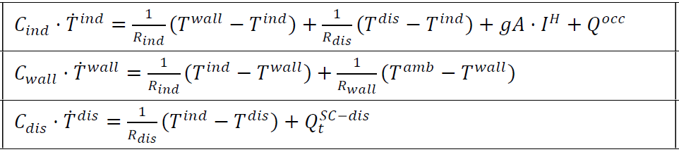
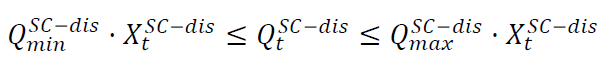

.. _advanced_under_development_features:

Advanced under-development features
===================================

Building model
--------------

A linear RC building model is presently under-development to replace the static space heating demand profiles. A building
model is a grey-box model which is often used to depict the thermal behaviour of a building in a simplified manner. It is
implemented as a custom sink component along with a set of new constraints.

.. image:: ./resources/building_model_oemof.png
      :width: 400
      :alt: building_model_oemof

The specific building model implemented in optihood was proposed and validated in [1] and is characterized by three thermal
spaces:

- wall and building mass
- indoor air
- distribution system

Each thermal space is at a certain temperature at a particular timestep. Moreover, each thermal space has two key parameters
which represent the thermal resistance and thermal capacity. The temperature of each thermal space is influenced by the
temperature of adjascent thermal spaces, heat flow, internal heat gains and ambient weather conditions.

.. image:: ./resources/building_model.png
      :width: 600
      :alt: building_model

The parameters and variables of the RC model are described below:

+----------------------------------------------------------------------------------------------------------------------+
| **Parameters**                                                                                                       |
+---------------------------+------------------------------------------------------------------------------------------+
| :math:`R_{ind}`           |  Thermal resistance between indoor and wall states [K/kW]                                |
+---------------------------+------------------------------------------------------------------------------------------+
| :math:`R_{wall}`          |  Thermal resistance between wall state and outside [K/kW]                                |
+---------------------------+------------------------------------------------------------------------------------------+
| :math:`R_{dis}`           |  Thermal resistance between indoor and distribution system states [K/kW]                 |
+---------------------------+------------------------------------------------------------------------------------------+
| :math:`C_{ind}`           |  Thermal capacity of the indoor air state [kWh/K]                                        |
+---------------------------+------------------------------------------------------------------------------------------+
| :math:`C_{wall}`          |  Thermal capacity of the wall state [kWh/K]                                              |
+---------------------------+------------------------------------------------------------------------------------------+
| :math:`C_{dis}`           |  Thermal capacity of the distribution system state [kWh/K]                               |
+---------------------------+------------------------------------------------------------------------------------------+
| :math:`gA`                |  Aperture area of the windows [:math:`m^2`]                                              |
+---------------------------+------------------------------------------------------------------------------------------+
| :math:`Q^{dis}_{min}`     |  Minimum operating power from the tank to the distribution system [kW]                   |
+---------------------------+------------------------------------------------------------------------------------------+
| :math:`Q^{dis}_{max}`     |  Maximum operating power from the tank to the distribution system [kW]                   |
+---------------------------+------------------------------------------------------------------------------------------+
| :math:`T^{ind}_{min}`     |  Indoor minimum comfort temperature [°C]                                                 |
+---------------------------+------------------------------------------------------------------------------------------+
| :math:`T^{ind}_{max}`     |  Indoor maximum comfort temperature [°C]                                                 |
+---------------------------+------------------------------------------------------------------------------------------+
| **Exogenous input parameters**                                                                                       |
+---------------------------+------------------------------------------------------------------------------------------+
| :math:`T^{amb}_{t}`       |  Ambient outside air temperature at :math:`t^{th}` timestep [°C]                         |
+---------------------------+------------------------------------------------------------------------------------------+
| :math:`I^{H}_{t}`         |  Total horizontal irradiation at :math:`t^{th}` timestep [kW/:math:`m^2`]                |
+---------------------------+------------------------------------------------------------------------------------------+
| :math:`Q^{occ}_{t}`       |  Internal heat gains from occupants at :math:`t^{th}` timestep [kW]                      |
+---------------------------+------------------------------------------------------------------------------------------+
| **Boundary parameters**                                                                                              |
+---------------------------+------------------------------------------------------------------------------------------+
| :math:`T^{ind}_{init}`    |  Indoor initial temperature [°C]                                                         |
+---------------------------+------------------------------------------------------------------------------------------+
| :math:`T^{wall}_{init}`   |  Wall initial temperature [°C]                                                           |
+---------------------------+------------------------------------------------------------------------------------------+
| :math:`T^{dis}_{init}`    |  Distribution system initial temperature [°C]                                            |
+---------------------------+------------------------------------------------------------------------------------------+
| **State variables**                                                                                                  |
+---------------------------+------------------------------------------------------------------------------------------+
| :math:`T^{ind}_t`         |  Indoor temperature at :math:`t^{th}` timestep [°C]                                      |
+---------------------------+------------------------------------------------------------------------------------------+
| :math:`T^{wall}_t`        |  Wall temperature at :math:`t^{th}` timestep [°C]                                        |
+---------------------------+------------------------------------------------------------------------------------------+
| :math:`T^{dis}_t`         |  Distribution system temperature at :math:`t^{th}` timestep [°C]                         |
+---------------------------+------------------------------------------------------------------------------------------+
| :math:`\epsilon^{ind}_t`  | Violation of indoor comfort temperature range at :math:`t^{th}` timestep [°C]            |
+---------------------------+------------------------------------------------------------------------------------------+
| :math:`\delta^{ind}_t`    |  Violation of indoor final temperature requirement [°C]                                  |
+---------------------------+------------------------------------------------------------------------------------------+
| :math:`P^{dis}_t`         |  Electric consumption of the distribution system                                         |
+---------------------------+------------------------------------------------------------------------------------------+
| **Decision variable**                                                                                                |
+---------------------------+------------------------------------------------------------------------------------------+
| :math:`Q^{dis}_t`         | Heating power from the tank to the distribution system at :math:`t^{th}` timestep [kW]   |
+---------------------------+------------------------------------------------------------------------------------------+

The state space equations of the building model are:

The final constraints of the building model are:

|

.. image:: ./resources/Constraint2.png
      :width: 150
      :alt: constraint2

|

.. image:: ./resources/Constraint3.png
      :width: 300
      :alt: constraint3

|

.. image:: ./resources/Constraint4.png
      :width: 230
      :alt: constraint4

|

[1] T. Péan, R. Costa Castelló y J. Salom, Price and carbon-based energy flexibility of residential heating and cooling loads using model predictive control, Sustainable Cities and Society, vol. 50, 2019

Clustering
----------

To be completed

